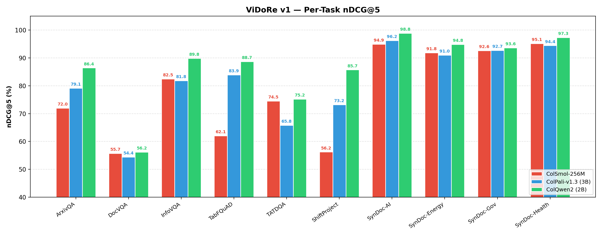
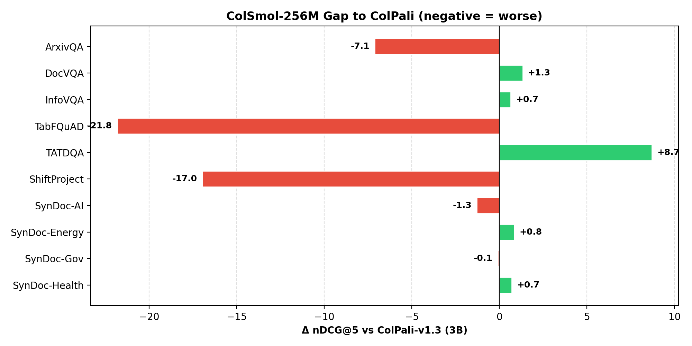
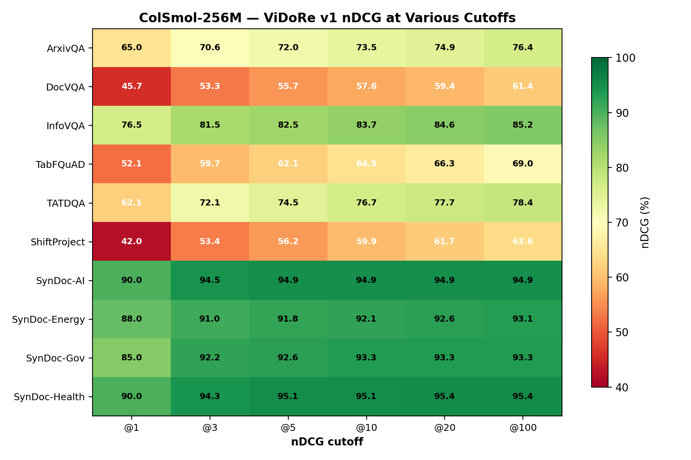
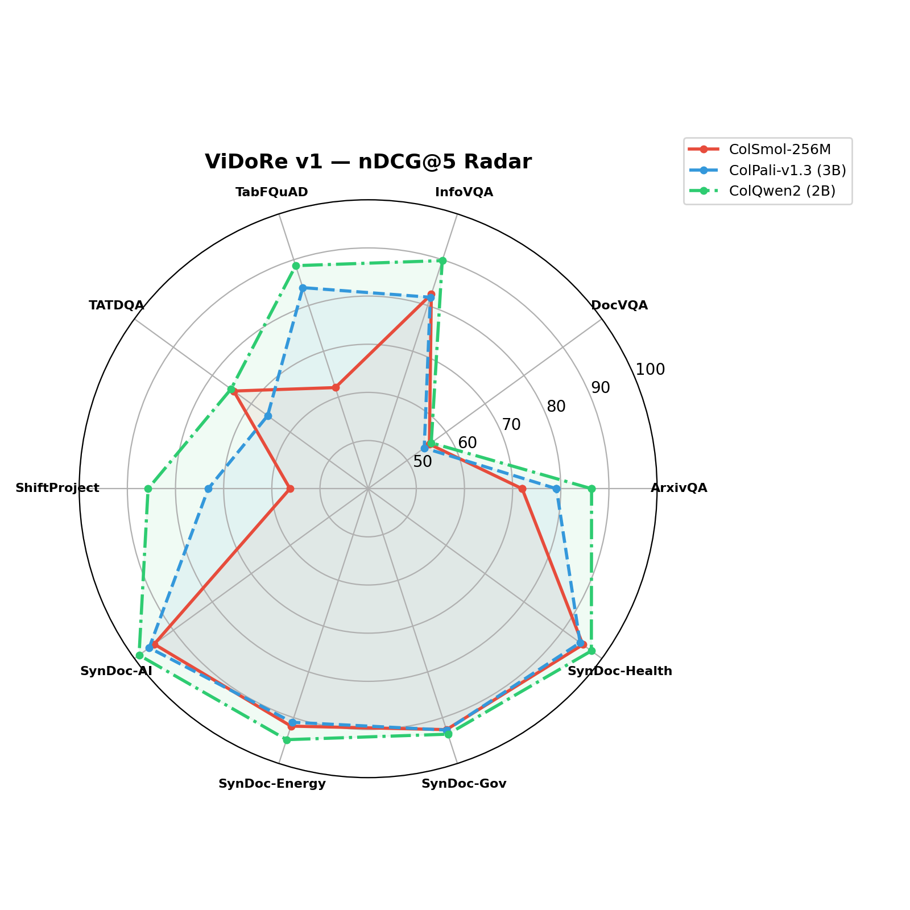
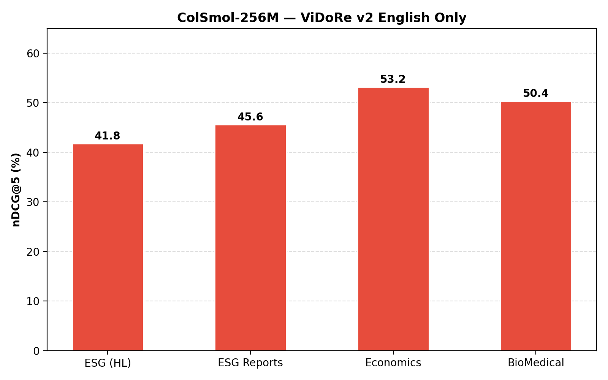
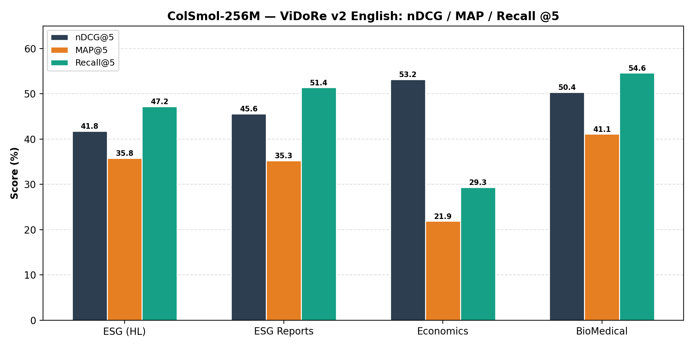
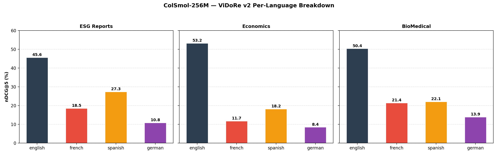

# ColSmol-Reasoning — Technical Audit

15 Feb 2026. Full codebase review covering architecture, training, losses, data, and experimental state.

---

## 1. Architecture

### 1.1 Backbone

Student is **ColSmol-256M** — a compact SmolVLM (Idefics3) that pairs a SigLIP vision encoder with a small LM backbone. Loaded from `vidore/colSmol-256M` via `colpali_engine` (`ColIdefics3`).

SigLIP produces patch-level embeddings from the image. These get fed into the LM where they're contextualised with any text tokens. Output is one embedding per token/patch — the multi-vector representation needed for late interaction.

Teachers for distillation: **ColPali-v1.3** (3B) and **ColQwen2-v1.0** (2B). Always frozen, default to CPU to leave GPU free for the student.

### 1.2 Projection

Single linear layer maps LM hidden dim → **D = 128** (standard ColBERT dimensionality). Inherited from the pretrained checkpoint, not re-implemented. No MLP, no nonlinearity — just a linear projection.

### 1.3 MaxSim (Late Interaction)

$$\text{score}(Q, D) = \sum_{i} \max_{j} \langle q_i, d_j \rangle$$

Implemented in multiple places. Training code builds the $B \times B$ score matrix iteratively (one query at a time) to keep memory in check — the full 4D tensor doesn't fit at useful batch sizes. Eval code chunks queries/docs into groups of 32 on CPU for the same reason.

### 1.4 LoRA Setup

`vidore/colSmol-256M` already ships as a PEFT model. The wrapper detects this and reuses the existing adapter.

- Targets: `q_proj`, `v_proj`
- Rank 32, alpha 32, dropout 0.05
- Gradient checkpointing off (deliberate — stability)

---

## 2. The Two Ideas

### 2.1 MID — MaxSim Interaction Distillation

Three-part loss:

$$L = \alpha \cdot L_{\text{contrastive}} + \beta \cdot L_{\text{interaction}} + \gamma \cdot L_{\text{ranking}}$$

- **Contrastive:** InfoNCE over in-batch MaxSim scores.
- **Interaction:** KL-div between teacher and student token-level attention maps — which query token should match which doc patch. Scaled by $T^2$.
- **Ranking:** Pairwise hinge loss. If teacher prefers doc $i$ over $j$, student must too, by at least margin 0.1.

Weights: $\alpha=1.0$, $\beta=1.0$, $\gamma=0.5$.

No architectural changes to the student. The novelty is entirely in the loss signal from the teacher.

**Status: fully coded, never run on real data.**

### 2.2 R2R — Reason-to-Retrieve

Queries get augmented with a reasoning trace before encoding:

`[query] [SEP] [reasoning_trace]`

The trace describes what visual evidence to look for ("bar chart", "Q1–Q4 columns", etc.). These extra tokens produce additional embeddings that participate in MaxSim, giving the model explicit grounding hints it otherwise can't infer at 256M scale.

**Trace generation:** Frozen Qwen2.5-0.5B-Instruct, prompted to output 2–3 sentences of visual grounding cues. ~7.8k traces pre-computed for training; cached on-the-fly at eval.

**Training loss:** Plain InfoNCE with in-batch negatives on augmented queries. Temperature 0.1. Embeddings L2-normalised in fp32 (stability fix for bf16 overflow).

**Ablation controls:**
- `use` — aligned traces (experimental condition)
- `none` — query only (baseline)
- `shuffle` — mismatched traces (length control)

If `use > none`: reasoning helps. If `use > shuffle`: it's the content, not just extra tokens.

### 2.3 Not Implemented

- No hard negative mining — in-batch negatives only.
- No "thinking tokens" or architectural modifications.
- No auxiliary reasoning losses.
- **No combined R2R+MID trainer** 
---

## 3. Training Config

### R2R (primary track)

| Param | Value |
|---|---|
| Model | ColSmol-256M + LoRA (r=32) |
| LR | 5e-6 |
| Batch / accum / effective | 2 / 8 / 16 |
| Epochs | 3 |
| Temperature | 0.1 |
| Optimizer | AdamW (wd=0.01) |
| Precision | bf16 |
| Training data | `vidore/colpali_train_set` (streaming, ~118k pairs) |
| Traces | ~7.8k from Qwen2.5-0.5B |

### MID (not yet run)

| Param | Value |
|---|---|
| Teacher | ColPali-v1.3 (3B, CPU) |
| Student | ColSmol-256M + LoRA (r=32, GPU) |
| LR | 2e-5 |
| Batch / accum / effective | 2 / 8 / 16 |
| Epochs | 1 |
| KD temperature | 2.0 |
| Weights (α, β, γ) | 1.0, 1.0, 0.5 |

### Evaluation benchmarks

- **ViDoRe v1:** 10 subtasks (ArxivQA, DocVQA, InfoVQA, TabFQuAD, TATDQA, ShiftProject, 4× SyntheticDocQA)
- **ViDoRe v2:** 4 subtasks (ESG HL, ESG Reports, Economics, BioMedical)
- **ViDoRe v3:** Referenced in scripts and the ICDAR proposal but no definition in the data loader — relies on MTEB resolving the name at runtime

---

## 4. Results

All numbers below come directly from the MTEB JSON evaluation outputs stored in `results/`. Reference scores for ColPali-v1.3 (3B) and ColQwen2 (2B) are taken from their respective papers. Charts are in `results/charts/`.

---

### 4.1 ViDoRe v1 — Primary Benchmark (10 Subtasks)

#### 4.1.1 nDCG@5 Comparison (ColSmol vs Teachers)

| Task | ColSmol-256M | ColPali (3B) | ColQwen2 (2B) | Δ ColPali |
|---|---:|---:|---:|---:|
| ArxivQA | 72.0 | 79.1 | 86.4 | −7.1 |
| DocVQA | 55.7 | 54.4 | 56.2 | +1.3 |
| InfoVQA | 82.5 | 81.8 | 89.8 | +0.7 |
| TabFQuAD | 62.1 | 83.9 | 88.7 | −21.8 |
| TATDQA | 74.5 | 65.8 | 75.2 | +8.7 |
| ShiftProject | 56.2 | 73.2 | 85.7 | −17.0 |
| SynDoc-AI | 94.9 | 96.2 | 98.8 | −1.3 |
| SynDoc-Energy | 91.8 | 91.0 | 94.8 | +0.8 |
| SynDoc-Gov | 92.6 | 92.7 | 93.6 | −0.1 |
| SynDoc-Health | 95.1 | 94.4 | 97.3 | +0.7 |
| **Average** | **77.7** | **81.3** | **86.6** | **−3.6** |

ColSmol actually beats ColPali on 5 of 10 subtasks (DocVQA, InfoVQA, TATDQA, SynDoc-Energy, SynDoc-Health). The average gap is dragged down by three tasks where layout/table understanding matters most: TabFQuAD (−21.8), ShiftProject (−17.0), and ArxivQA (−7.1).

#### 4.1.2 nDCG Across Cutoffs

Full nDCG breakdown at k ∈ {1, 3, 5, 10, 20, 100} from the MTEB JSONs:

| Task | @1 | @3 | @5 | @10 | @20 | @100 |
|---|---:|---:|---:|---:|---:|---:|
| ArxivQA | 65.0 | 70.6 | 72.0 | 73.5 | 74.9 | 76.4 |
| DocVQA | 45.7 | 53.3 | 55.7 | 57.6 | 59.4 | 61.4 |
| InfoVQA | 76.5 | 81.5 | 82.5 | 83.7 | 84.6 | 85.2 |
| TabFQuAD | 52.1 | 59.7 | 62.1 | 64.5 | 66.3 | 69.0 |
| TATDQA | 62.1 | 72.1 | 74.5 | 76.7 | 77.7 | 78.4 |
| ShiftProject | 42.0 | 53.4 | 56.2 | 59.9 | 61.7 | 63.6 |
| SynDoc-AI | 90.0 | 94.5 | 94.9 | 94.9 | 94.9 | 94.9 |
| SynDoc-Energy | 88.0 | 91.0 | 91.8 | 92.1 | 92.6 | 93.1 |
| SynDoc-Gov | 85.0 | 92.2 | 92.6 | 93.3 | 93.3 | 93.3 |
| SynDoc-Health | 90.0 | 94.3 | 95.1 | 95.1 | 95.4 | 95.4 |

#### 4.1.3 Recall@k

| Task | @1 | @5 | @10 | @20 | @100 |
|---|---:|---:|---:|---:|---:|
| ArxivQA | 65.0 | 78.2 | 83.0 | 88.4 | 96.4 |
| DocVQA | 45.6 | 64.4 | 70.1 | 78.2 | 87.2 |
| InfoVQA | 76.4 | 87.2 | 90.9 | 93.5 | 98.0 |
| TabFQuAD | 52.1 | 70.7 | 78.2 | 85.0 | 100.0 |
| TATDQA | 61.9 | 84.9 | 91.7 | 95.0 | 99.0 |
| ShiftProject | 42.0 | 69.0 | 80.0 | 86.0 | 97.0 |
| SynDoc-AI | 90.0 | 99.0 | 99.0 | 99.0 | 99.0 |
| SynDoc-Energy | 88.0 | 95.0 | 96.0 | 98.0 | 100.0 |
| SynDoc-Gov | 85.0 | 98.0 | 100.0 | 100.0 | 100.0 |
| SynDoc-Health | 90.0 | 99.0 | 99.0 | 99.0 | 100.0 |

Even on the hard tasks, Recall@100 is north of 96% everywhere — the relevant documents exist in the top 100, they're just not ranked high enough.

#### 4.1.4 MAP and MRR @5

| Task | MAP@5 | MRR@5 |
|---|---:|---:|
| ArxivQA | 69.9 | 69.9 |
| DocVQA | 52.7 | 53.0 |
| InfoVQA | 80.8 | 80.8 |
| TabFQuAD | 59.2 | 59.2 |
| TATDQA | 71.0 | 71.1 |
| ShiftProject | 52.0 | 52.0 |
| SynDoc-AI | 93.5 | 93.5 |
| SynDoc-Energy | 90.8 | 90.8 |
| SynDoc-Gov | 90.8 | 90.8 |
| SynDoc-Health | 93.8 | 93.8 |

#### 4.1.5 Accuracy (Exact Match @1)

| Task | Accuracy |
|---|---:|
| ArxivQA | 0.650 |
| DocVQA | 0.456 |
| InfoVQA | 0.764 |
| TabFQuAD | 0.521 |
| TATDQA | 0.619 |
| ShiftProject | 0.420 |
| SynDoc-AI | 0.900 |
| SynDoc-Energy | 0.880 |
| SynDoc-Gov | 0.850 |
| SynDoc-Health | 0.900 |

---

### 4.2 ViDoRe v2 — Multilingual Benchmark (4 Tasks × 4 Languages)

V2 evaluates on harder, domain-specific documents in English, French, Spanish, and German. ESG (HL) has a single "default" subset; the other three have four language subsets each.

#### 4.2.1 English-Only nDCG@5

| Task | nDCG@5 | MAP@5 | Recall@5 | MRR@5 | Accuracy |
|---|---:|---:|---:|---:|---:|
| ESG (HL) | 41.8 | 35.8 | 47.2 | 47.4 | 0.271 |
| ESG Reports | 45.6 | 35.3 | 51.4 | 50.6 | 0.191 |
| Economics | 53.2 | 21.9 | 29.3 | 68.5 | 0.062 |
| BioMedical | 50.4 | 41.1 | 54.6 | 58.2 | 0.275 |
| **Average** | **47.7** | **33.5** | **45.6** | **56.2** | **0.200** |

Substantially harder than v1. Average nDCG@5 drops from 77.7 (v1) to 47.7 (v2).

#### 4.2.2 Per-Language nDCG@5 Breakdown

| Task | English | French | Spanish | German |
|---|---:|---:|---:|---:|
| ESG Reports | 45.6 | 18.5 | 27.3 | 10.8 |
| Economics | 53.2 | 11.7 | 18.2 | 8.4 |
| BioMedical | 50.4 | 21.4 | 22.1 | 13.9 |

Non-English performance drops dramatically — German nDCG@5 is below 14% on all tasks. This is expected for a model that was primarily trained on English data, but it quantifies how far off multilingual support is.

#### 4.2.3 Recall@k for English Subsets

| Task | @1 | @5 | @10 | @20 | @100 |
|---|---:|---:|---:|---:|---:|
| ESG (HL) | 27.1 | 47.2 | 53.3 | 62.8 | 90.4 |
| ESG Reports | 19.1 | 51.4 | 70.2 | 81.0 | 97.1 |
| Economics | 6.2 | 29.3 | 44.8 | 57.2 | 88.4 |
| BioMedical | 27.5 | 54.6 | 64.5 | 72.3 | 86.9 |

Recall@100 remains high (86–97%), matching the v1 pattern: the retriever surfaces relevant documents within the top 100 but struggles to rank them precisely at the top.

---

### 4.3 R2R Ablation — Training Complete, No Evaluation Results in Repo

All three ablation training runs completed (seed 42):
- `r2r_use_seed42` — aligned traces
- `r2r_none_seed42` — query only baseline
- `r2r_shuffle_seed42` — mismatched traces (length control)

The 9-run evaluation matrix (3 trace modes × 3 benchmarks) was launched. **No R2R evaluation result files exist in the repository.** Training metric CSVs (`train_metrics.csv`) are written to git-ignored `checkpoints/` directories and are also absent from the committed tree.

From the experiment log, the partial signal observed during evaluation was not encouraging — the expected `use > none > shuffle` ordering did not materialize clearly across tasks.

---

### 4.4 Summary of All Available Results

| Source | Benchmark | Tasks | Metrics Available | Status |
|---|---|---|---|---|
| `results/v1/` | ViDoRe v1 | 10 subtasks | nDCG, MAP, Recall, MRR, Precision, Accuracy @{1,3,5,10,20,100,1000} + NAUC variants | Complete |
| `results/v2/` | ViDoRe v2 | 4 tasks × 4 langs | Same metric set as v1, per-language subsets | Complete |
| `results/results_v1.csv` | ViDoRe v1 | Summary | nDCG@5 + ColPali/ColQwen2 reference | Complete |
| `results/results_v2.csv` | ViDoRe v2 | Summary | nDCG@5 English-only | Complete |
| `results/charts/` | Visualizations | 13 PNGs | Bar, heatmap, radar, recall curves, gap, language breakdown | Complete |
| R2R ablation evals | ViDoRe v1/v2/v3 | — | — | **Not committed** |
| MID training | — | — | — | **Never run** |

---

## 5. Tried vs. Untested

| Component | Code | Executed |
|---|---|---|
| Baseline eval (v1, v2) | Done | Done — full results in repo |
| R2R trace generation | Done | Done — ~7.8k traces |
| R2R training (3 ablations) | Done | Done — all converged |
| R2R evaluation | Done | Launched — no results committed |
| MID losses | Done | Unit tests only |
| MID training | Done | Never run |
| Combined R2R+MID | Not built | — |
| Hard negatives | Half-built | Never used |
| LR warmup | Not built | — |

---

## Bottom Line

ColSmol-256M already beats ColPali-v1.3 (3B) on 5/10 ViDoRe v1 subtasks — the deficit is concentrated on table-heavy and layout-heavy tasks (TabFQuAD, ShiftProject, ArxivQA). Recall@100 is above 96% everywhere, so the relevant documents are in the candidate set; ranking precision at the top is the bottleneck.

V2 is a different story: average English nDCG@5 is 47.7%, and non-English performance falls below 14% on some tasks. Multilingual support is effectively absent.

R2R training completed in all three ablation modes, but evaluation results have not been committed to the repository. The partial signals observed were not promising.

MID has never been trained. The combined R2R+MID experiment hasn't been started.
